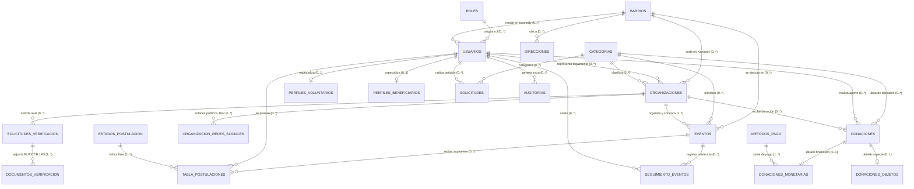

# INFORME DE NORMALIZACIÓN Y MODELO ENTIDAD-RELACIÓN v3.1
## Base de Datos Relacional: `giveandgo_v2`
### Ámbito Operacional: Localidad de Kennedy (Bogotá D.C., Colombia)

---

## 1. Contexto y Nuevos Requerimientos de Dominio

En esta iteración del sistema **Give&Go**, se aplicaron decisiones de negocio y simplificaciones estructurales respetando rigurosamente las **Formas Normales (1FN, 2FN, 3FN y BCNF)** y la **Integridad Referencial**:

1. **Delimitación Geográfica Exclusiva (Localidad de Kennedy):**
   - **Tablas Eliminadas:** `paises`, `departamentos`, `ciudades`, `localidades`.
   - **Justificación:** El sistema opera territorialmente de forma exclusiva en la **Localidad de Kennedy (Bogotá D.C., Colombia)**. Mantener jerarquías estáticas a nivel de país, departamento y ciudad generaba redundancia y dependencias transitivas artificiales.
   - **Solución Normalizada:** La división geográfica variable se ancla de forma directa y atómica en la tabla `barrios` (UPZ y barrios representativos de Kennedy: *Kennedy Central, Castilla, Patio Bonito, El Tintal, Timiza, Mandalay, Carvajal, Pastrana*). La tabla `direcciones` modela coordenadas georreferenciadas (latitud/longitud) asociadas al barrio respectivo.

2. **Supresión de Documentos de Identidad a Personas Individuales:**
   - **Tablas y Columnas Eliminadas:** Tabla `tipos_documento`; columnas `id_tipo_documento`, `tipo_documento` y `num_documento` de la tabla `usuarios`.
   - **Regla de Negocio:** La plataforma promueve el libre acceso ciudadano al voluntariado y a la ayuda comunitaria, sin exigir cédulas ni pasaportes a las personas naturales para registrarse o postularse.
   - **Excepción Formal (Organizaciones):** Se preserva la verificación documental legal (RUT, Cámara de Comercio de Bogotá, etc.) exclusivamente en la relación normalizada 1FN: `documentos_verificacion` vinculada a `solicitudes_verificacion`.

3. **Perfiles Públicos y Redes Sociales Reservados a Organizaciones:**
   - **Tablas y Columnas Eliminadas:** Tabla `usuario_redes_sociales`. Se eliminaron de los usuarios particulares las propiedades corporativas (sitio web, misión, visión, redes sociales, portada institucional).
   - **Regla de Negocio:** Las personas físicas cuentan con datos de contacto básicos y un avatar personal. Solo las **Organizaciones** requieren proyección pública detallada (misión, visión, sitio web, logo institucional y redes sociales) para generar confianza y transparencia comunitaria.
   - **Estructura Normalizada:** Las redes de organizaciones se gestionan de forma atómica en `organizacion_redes_sociales` (1FN).

---

## 2. Análisis Formal de Normalización

### 2.1 Primera Forma Normal (1FN)
* **Requisitos:**
  1. Todos los atributos contienen valores indivisibles (atómicos).
  2. No existen grupos repetitivos o listas serializadas como cadenas separadas por comas.
  3. Cada tabla posee una clave primaria (`PRIMARY KEY`) definida.
* **Cumplimiento en `giveandgo_v2`:**
  - **Nombres y Apellidos Atómicos:** `nombre1`, `nombre2`, `apellido1`, `apellido2`.
  - **Documentos de Verificación Organizacional:** Desglosados en filas atómicas dentro de `documentos_verificacion` con atributos (`id_documento`, `solicitud_id`, `tipo_documento`, `url_archivo`).
  - **Redes Sociales Institucionales:** Desglosadas en filas individuales en `organizacion_redes_sociales` (`organizacion_id`, `plataforma`, `url_perfil`), con restricción de unicidad compuesta `UNIQUE(organizacion_id, plataforma)`.

### 2.2 Segunda Forma Normal (2FN)
* **Requisitos:**
  1. Cumplir con la 1FN.
  2. Todos los atributos que no forman parte de una clave deben depender de forma **completa** de la clave primaria (sin dependencias funcionales parciales sobre claves compuestas).
* **Cumplimiento en `giveandgo_v2`:**
  - En tablas con claves simples (`usuarios`, `organizaciones`, `eventos`, `barrios`, `donaciones`), la 2FN se satisface por definición.
  - En tablas de intersección / relación muchos-a-muchos:
    - **`tabla_postulaciones`:** La clave primaria es `id_postulacion` con clave candidata compuesta `(id_evento, id_usuario, tipo_postulacion)`. Los atributos `asistencia_confirmada`, `horas_acreditadas`, `fecha_postulacion` y `id_estado_postulacion` dependen de la combinación completa del usuario postulándose al evento específico, no de uno de ellos por separado.
    - **`seguimiento_eventos`:** Clave candidata `(evento_id, usuario_id)`. La marca temporal `fecha` depende de la tupla completa del evento y el asistente.

### 2.3 Tercera Forma Normal (3FN)
* **Requisitos:**
  1. Cumplir con la 2FN.
  2. No deben existir **dependencias transitivas** entre atributos no clave (es decir, ningún atributo no primo debe depender funcionalmente de otro atributo no primo: $X \to Y$ donde $X$ no es superclave).
* **Cumplimiento en `giveandgo_v2`:**
  - **Ubicación Geográfica en Kennedy:** Se eliminó la dependencia transitiva $id\_barrio \to id\_localidad \to id\_ciudad \to id\_departamento \to id\_pais$. Dado que todo el sistema opera en Kennedy (Bogotá, Colombia), la única variable territorial es el barrio, eliminando redundancia de almacenamiento físico.
  - **Roles y Métodos de Pago:** Desacoplados en catálogos normalizados (`roles`, `metodos_pago`, `estados_postulacion`, `categorias`).
  - **Auditorías:** En `auditorias`, se normalizó `id_usuario` con clave foránea; la resolución de nombres y roles se realiza en tiempo de consulta mediante la vista `v_auditorias_completo`.

### 2.4 Forma Normal de Boyce-Codd (BCNF)
* **Requisitos:**
  - Para cada dependencia funcional no trivial $X \to Y$, el determinante $X$ debe ser una **superclave** de la relación.
* **Cumplimiento en `giveandgo_v2`:**
  - En todas las entidades de catálogo (`roles`, `metodos_pago`, `estados_postulacion`, `categorias`, `barrios`), las claves alternas (`codigo` o `nombre`) poseen índices únicos (`UNIQUE`), de modo que cualquier determinante funcional es una clave candidata válida.

---

## 3. Diccionario del Esquema Relacional (Tablas Principales)

### 3.1 Catálogos y Territorio
| Tabla | Clave Primaria | Claves Foráneas | Propósito / Dependencias |
|---|---|---|---|
| `roles` | `id_rol` | N/A | Tipos de actores (Admin, Voluntario, Beneficiario, Organizacion) |
| `metodos_pago` | `id_metodo_pago` | N/A | Formas de pago electrónico y físico |
| `estados_postulacion` | `id_estado_postulacion` | N/A | Estados del flujo de aspirantes a eventos |
| `categorias` | `id_categoria` | N/A | Categorías temáticas (Alimentos, Salud, Educación, etc.) |
| `barrios` | `id_barrio` | N/A | Barrios y sectores de la Localidad de Kennedy |
| `direcciones` | `id_direccion` | `id_barrio` $\to$ `barrios` | Puntos georreferenciados en Kennedy |

### 3.2 Actores y Perfiles
| Tabla | Clave Primaria | Claves Foráneas | Propósito / Dependencias |
|---|---|---|---|
| `usuarios` | `id_usuario` | `id_rol` $\to$ `roles` `id_barrio` $\to$ `barrios` | Supertipo general de usuarios sin documentos personales |
| `perfiles_voluntarios` | `usuario_id` | `usuario_id` $\to$ `usuarios` | Subtipo EER: horas acumuladas, disponibilidad, habilidades |
| `perfiles_beneficiarios` | `usuario_id` | `usuario_id` $\to$ `usuarios` | Subtipo EER: personas a cargo, prioridad, urgencias |
| `organizaciones` | `id_organizacion` | `id_usuario_representante` $\to$ `usuarios` `id_categoria` $\to$ `categorias` `id_barrio` $\to$ `barrios` | Instituciones con NIT, representante legal, misión y visión |
| `organizacion_redes_sociales` | `id_red` | `organizacion_id` $\to$ `organizaciones` | Redes sociales institucionales atómicas (1FN) |

### 3.3 Eventos, Postulaciones y Beneficios
| Tabla | Clave Primaria | Claves Foráneas | Propósito / Dependencias |
|---|---|---|---|
| `eventos` | `id_evento` | `id_categoria` $\to$ `categorias` `organizacion_id` $\to$ `organizaciones` `id_barrio` $\to$ `barrios` | Convocatorias y jornadas de voluntariado en Kennedy |
| `tabla_postulaciones` | `id_postulacion` | `id_evento` $\to$ `eventos` `id_usuario` $\to$ `usuarios` `id_estado_postulacion` $\to$ `estados_postulacion` | Inscripción y seguimiento de horas (2FN/BCNF) |
| `seguimiento_eventos` | `id_seguimiento` | `evento_id` $\to$ `eventos` `usuario_id` $\to$ `usuarios` | Registro de asistencia presencial |
| `solicitudes` | `id_solicitud` | `usuario_id` $\to$ `usuarios` `id_categoria` $\to$ `categorias` | Peticiones directas de ayuda por beneficiarios |

### 3.4 Donaciones, Auditoría y Verificación
| Tabla | Clave Primaria | Claves Foráneas | Propósito / Dependencias |
|---|---|---|---|
| `donaciones` | `id_donacion` | `id_categoria` $\to$ `categorias` `usuario_id` $\to$ `usuarios` `organizacion_id` $\to$ `organizaciones` | Registro general de aporte |
| `donaciones_monetarias` | `id` | `donacion_id` $\to$ `donaciones` `id_metodo_pago` $\to$ `metodos_pago` | Detalle financiero, valor, cuenta y referencia |
| `donaciones_objetos` | `id` | `donacion_id` $\to$ `donaciones` `id_categoria` $\to$ `categorias` | Detalle en especie, cantidad y estado de conservación |
| `auditorias` | `id_audit` | `id_usuario` $\to$ `usuarios` | Trazabilidad de seguridad en 3FN |
| `solicitudes_verificacion` | `id_solicitud` | `organizacion_id` $\to$ `organizaciones` `admin_revisor_id` $\to$ `usuarios` | Solicitudes de certificación legal para organizaciones |
| `documentos_verificacion` | `id_documento` | `solicitud_id` $\to$ `solicitudes_verificacion` | Archivos probatorios (RUT, Cámara de Comercio) en 1FN |

---

## 4. Diagrama Entidad-Relación (Crow's Foot Notation)

---

## 5. Vistas SQL de Compatibilidad (Cero Redundancia)

Las vistas implementadas en `views_compatibility.sql` permiten que aplicaciones cliente y generadores de reportes obtengan consultas ricas con datos descriptivos precalculados mediante `JOIN`:

1. **`v_usuarios_completo`**: Expone al usuario con su rol, su barrio en Kennedy y los atributos especializados (`perfiles_voluntarios`, `perfiles_beneficiarios`).
2. **`v_organizaciones_completo`**: Presenta la ficha pública de la organización (misión, visión, logo, sitio web, redes sociales, estado de verificación y categoría).
3. **`v_eventos_detalle`**: Proyecta la información del evento unificada con la organización anfitriona y las coordenadas del barrio en Kennedy.
4. **`v_auditorias_completo`**: Resuelve dinámicamente el nombre y rol del usuario auditado en tiempo real sin desnormalizar la tabla de auditoría.
5. **`v_solicitudes_verificacion_detalle`**: Agrega los datos institucionales (NIT, correo y nombre) en la gestión de verificación de organizaciones.

---

## 6. Conclusión Técnica

Con esta arquitectura de base de datos:
- Se garantiza la **integridad referencial estricta** mediante llaves foráneas con políticas declarativas (`CASCADE` y `SET NULL`).
- Se optimiza el almacenamiento al eliminar 4 niveles geográficos redundantes (`paises`, `departamentos`, `ciudades`, `localidades`), focalizando toda la precisión espacial en los **barrios de Kennedy**.
- Se preserva la **privacidad y accesibilidad de los ciudadanos**, al no requerir documentos de identidad personales ni tablas de redes sociales para particulares.
- Se asegura el **cumplimiento legal y la transparencia de las entidades benéficas**, resguardando los documentos formales de verificación (RUT, Cámara de Comercio) de forma atómica (1FN) y sus perfiles institucionales públicos.
